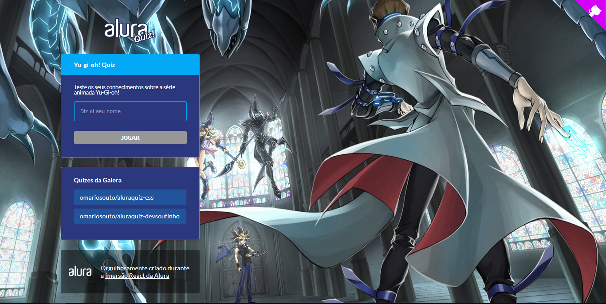
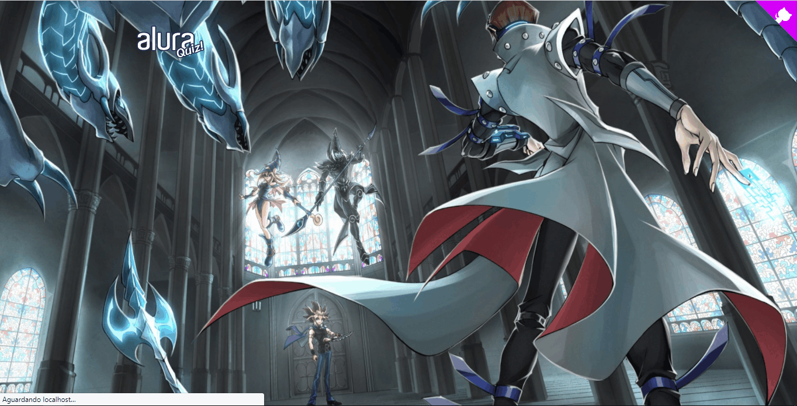

# YuGiQuiz
<h1>
  
</h1>

## Carregamento



## Marcando alternativas


---
<h3 align="center">
  <a href="https://aluraquiz-base-gab1005.vercel.app/" target="_blank">Visite a aplicação</a>
</h3>

---
## Indice
- [Discrição](#-Discrição)
- [Status](#-Status)
- [Aplicações do projeto](#-Aplicações-do-projeto)
- [Tecnologias](#-Tecnologias)
- [Como baixar](#-Como-baixar)
- [Autor](#-Autor)
- [Licença](#-Licença)

---
## Discrição

Aplicação feita em aulas ministradas pela equipe da <a href="https://www.alura.com.br/" target="_blank">Alura</a>.
A aplicação é um quiz sobre o anime YuGiOh!, se divirta respondendo ele em <a href="https://aluraquiz-base-gab1005.vercel.app/" target="_blank">aqui</a>.

---
## Status
Em construção.

---
## Aplicações do projeto
- [X] Base das animações.
- [X] Questões do quiz.
- [X] Mostrar resultado do quiz.
- [ ] Consertar bugs das animações.

---
## Tecnologias
- <a href="https://www.javascript.com/" target="_blank">JavaScript</a>
- <a href="https://nodejs.org/pt-br/" target="_blank">Node.js</a>
- <a href="https://nextjs.org/" target="_blank">Next.js</a>

---
## Como baixar
É necessário ter <a href="https://nodejs.org/pt-br/" target="_blank">Node.js</a>, e <a href="https://www.npmjs.com/get-npm" target="_blank">npm</a> ou <a href="https://classic.yarnpkg.com/en/docs/install/#windows-stable" target="_blank">yarn</a> já instalado em sua maquina, caso não tenha
click no nome respctivo. 

```bash
# No terminal, e no diretorio de sua escolha, copie e cole.
git clone https://github.com/gab1005/Alura_QuizYuGiOh
# ou use a opção de download do propio GitHub.

# Instale as dependências  
npm install

# Ou, se preferir yarn
yarn install

# Para executar
npm run

# para executar como desenvolvedor
npm run dev

# Ou, no yarn
yarn dev
```
Para demais dúvidas, acesse:
- <a href="https://nodejs.org/pt-br/" target="_blank">Node.js</a>
- <a href="https://www.npmjs.com/get-npm" target="_blank">npm</a>
- <a href="https://classic.yarnpkg.com/en/docs/install/#windows-stable" target="_blank">yarn</a>

---
## Autor
Feito por <a href="https://www.linkedin.com/in/sousaggabriel/" target="_blank">Gabriel Sousa</a>

---
## Licença
Este projeto esta sobe a licença [MIT](./LICENSE).
